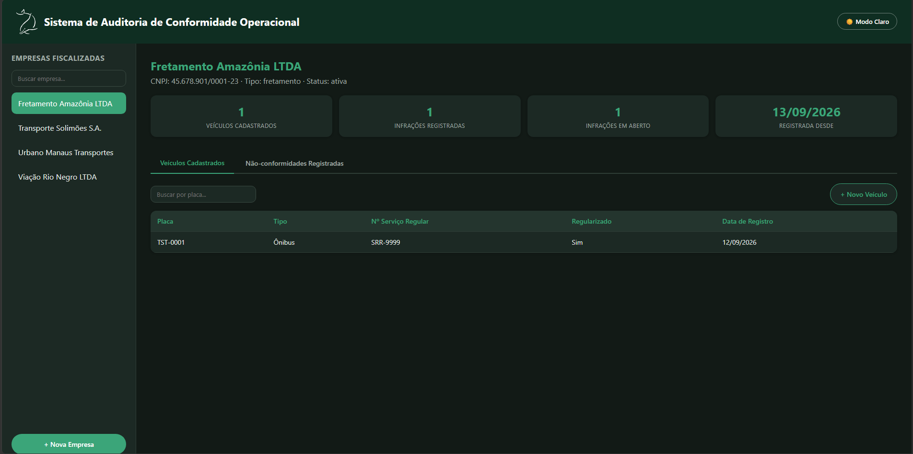
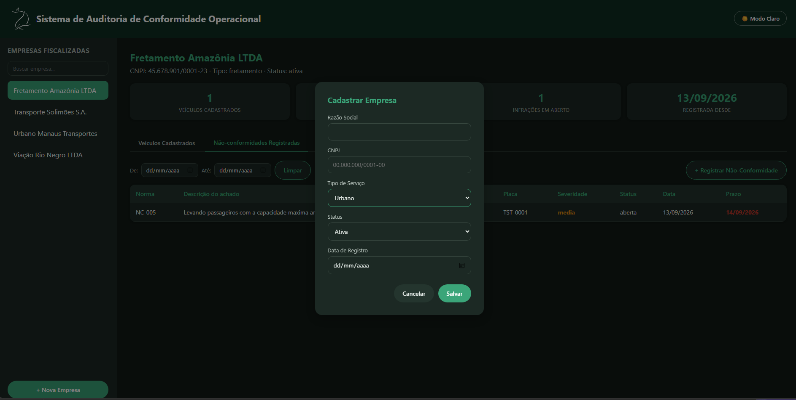
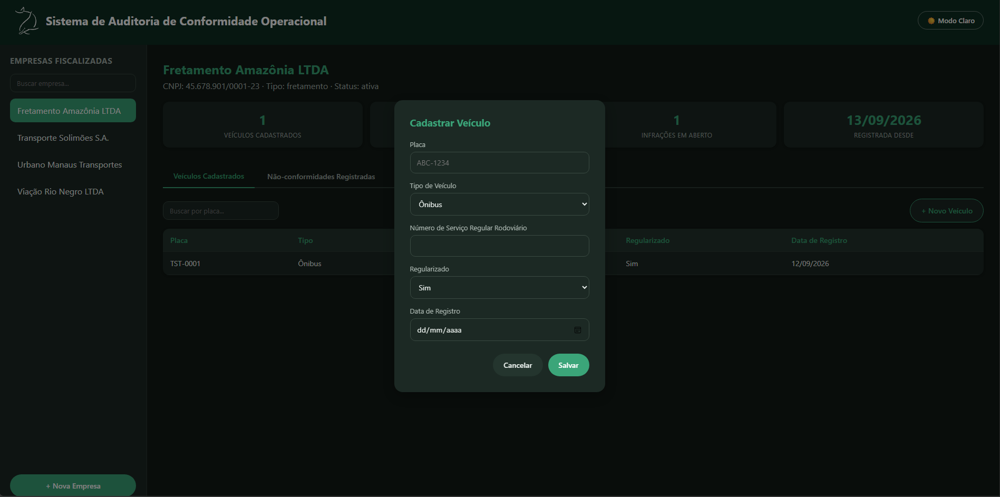
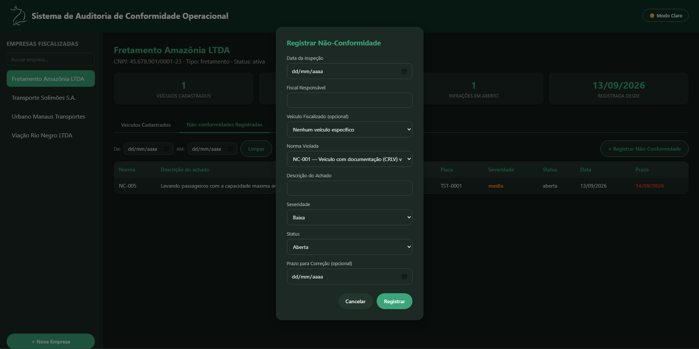
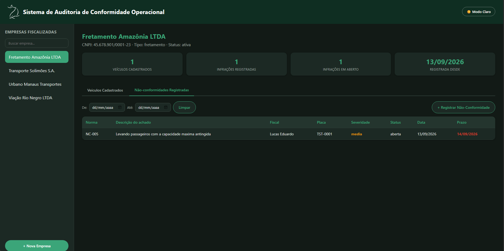

# Sistema de Auditoria de Conformidade Operacional

Sistema web para gestão de fiscalização de transporte intermunicipal, urbano e de fretamento — cadastro de empresas, veículos, normas regulatórias e registro de não-conformidades encontradas em inspeções.

## 📸 Screenshots

### Dashboard principal


### Cadastro de empresa


### Cadastro de veículo


### Registro de não-conformidade


### Não-conformidades com alerta de prazo vencido


## 🚀 Funcionalidades

- **Cadastro de empresas fiscalizadas** — razão social, CNPJ, tipo de serviço (urbano, intermunicipal, fretamento), data de registro
- **Cadastro de veículos por empresa** — placa, tipo (ônibus, micro-ônibus, van, táxi), número de serviço regular rodoviário, status de regularização
- **Registro de não-conformidades** — vinculadas a uma norma, severidade (baixa/média/alta), status, prazo de correção, e opcionalmente a um veículo específico
- **Reincidência automática** — identificação de empresas que repetem a mesma infração, via view SQL dedicada
- **Alertas visuais de prazo vencido** — destaque automático quando o prazo de correção passa e o status ainda não é "corrigida"
- **Busca e filtros** — busca de empresas por nome, busca de veículos por placa, filtro de não-conformidades por período
- **Perfil resumido por empresa** — cards com total de veículos, infrações totais, infrações em aberto e data de registro
- **Modo escuro** — tema persistente entre sessões (via `localStorage`)
- **Auditoria de dados** — registros de veículos e não-conformidades não podem ser editados nem excluídos, preservando o histórico de fiscalização

## 🛠️ Tecnologias

- **Banco de dados:** PostgreSQL
- **Backend:** Node.js, Express
- **Frontend:** HTML, CSS e JavaScript puro (sem frameworks)
- **Driver de banco:** `pg` (node-postgres)

## 🏗️ Decisões de arquitetura

### Modelagem relacional
O banco possui 5 entidades principais: `entidades_fiscalizadas`, `veiculos`, `normas_conformidade`, `inspecoes` e `nao_conformidades`, com chaves estrangeiras garantindo integridade referencial. A relação entre `nao_conformidades` e `veiculos` é opcional (`LEFT JOIN`), já que nem toda não-conformidade está associada a um veículo específico.

### Tipos ENUM
Campos de categoria fixa (status, severidade, tipo de veículo) usam tipos `ENUM` nativos do PostgreSQL, garantindo que valores inválidos sejam rejeitados diretamente no banco — independentemente da camada de aplicação que estiver inserindo os dados.

### Migrações incrementais
Alterações na estrutura do banco (como a adição da tabela `veiculos` após o sistema já estar em uso) foram feitas via scripts de migração incrementais (`ALTER TABLE`), preservando os dados existentes em vez de recriar o schema do zero.

### Transações de banco de dados
A criação de uma não-conformidade envolve dois `INSERT`s relacionados (inspeção + não-conformidade). Essa operação é executada dentro de uma transação (`BEGIN`/`COMMIT`/`ROLLBACK`), garantindo que ambos os registros sejam criados com sucesso ou nenhum deles seja persistido em caso de erro.

### Prevenção de SQL Injection
Todas as consultas ao banco usam queries parametrizadas (`$1`, `$2`, ...), nunca concatenação direta de strings com dados do usuário.

### Tratamento de erros específicos
A API identifica códigos de erro do PostgreSQL (`23505` para violação de unicidade, `23503` para violação de chave estrangeira) e retorna mensagens de erro específicas e códigos HTTP apropriados (`409 Conflict`), em vez de erros genéricos.

### Imutabilidade de registros de auditoria
Por decisão de negócio, veículos e não-conformidades não possuem rotas de edição ou exclusão — nem na interface, nem na API. Isso preserva a integridade do histórico de fiscalização, um requisito comum em sistemas regulatórios reais.

## 📁 Estrutura do projeto
sistema-auditoria-conformidade/
├── database/
│ ├── schema.sql # Criação das tabelas e tipos ENUM
│ ├── seed.sql # Dados de teste (empresas, normas, inspeções)
│ ├── seed_veiculos.sql # Dados de teste (veículos)
│ ├── views.sql # View de reincidência
│ └── migration_*.sql # Migrações incrementais
├── public/
│ ├── index.html
│ ├── style.css
│ └── script.js
├── screenshots/
├── db.js # Configuração da conexão com PostgreSQL
├── index.js # Servidor Express e rotas da API
└── package.json


## ⚙️ Como rodar localmente

### Pré-requisitos
- [Node.js](https://nodejs.org/) (v18+)
- [PostgreSQL](https://www.postgresql.org/download/) (v14+)

### Passos

1. Clone o repositório:
```bash
git clone https://github.com/LucassEdu/sistema-auditoria-conformidade.git
cd sistema-auditoria-conformidade
```

2. Instale as dependências:
```bash
npm install
```

3. Crie o banco de dados no PostgreSQL:
```bash
psql -U postgres -c "CREATE DATABASE auditoria_conformidade;"
```

4. Rode o schema e as migrações, na ordem:
```bash
psql -U postgres -d auditoria_conformidade -f database/schema.sql
psql -U postgres -d auditoria_conformidade -f database/seed.sql
psql -U postgres -d auditoria_conformidade -f database/views.sql
psql -U postgres -d auditoria_conformidade -f database/migration_veiculos.sql
psql -U postgres -d auditoria_conformidade -f database/seed_veiculos.sql
psql -U postgres -d auditoria_conformidade -f database/migration_veiculos_2.sql
psql -U postgres -d auditoria_conformidade -f database/migration_empresa_registro.sql
```

5. Crie um arquivo `.env` na raiz do projeto:


6. Inicie o servidor:
```bash
node index.js
```

7. Acesse `http://localhost:3000` no navegador.

## 📡 Principais rotas da API

| Método | Rota | Descrição |
|---|---|---|
| GET | `/entidades` | Lista todas as empresas |
| POST | `/entidades` | Cadastra uma nova empresa |
| GET | `/entidades/:id/veiculos` | Lista veículos de uma empresa |
| POST | `/entidades/:id/veiculos` | Cadastra um veículo |
| PUT | `/veiculos/:id` | Atualiza um veículo |
| GET | `/entidades/:id/nao-conformidades` | Lista não-conformidades de uma empresa |
| POST | `/entidades/:id/nao-conformidades` | Registra uma inspeção com não-conformidade |
| GET | `/normas` | Lista as normas de conformidade |
| GET | `/reincidencias` | Lista empresas com reincidência de infrações |

## 📄 Licença

Este projeto está sob a licença MIT.